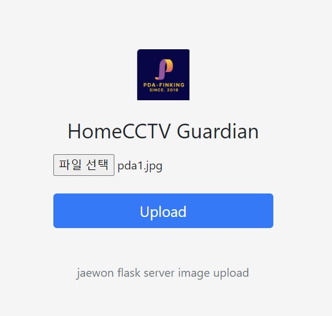
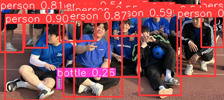
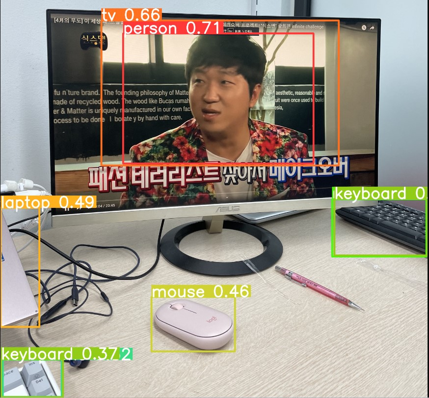
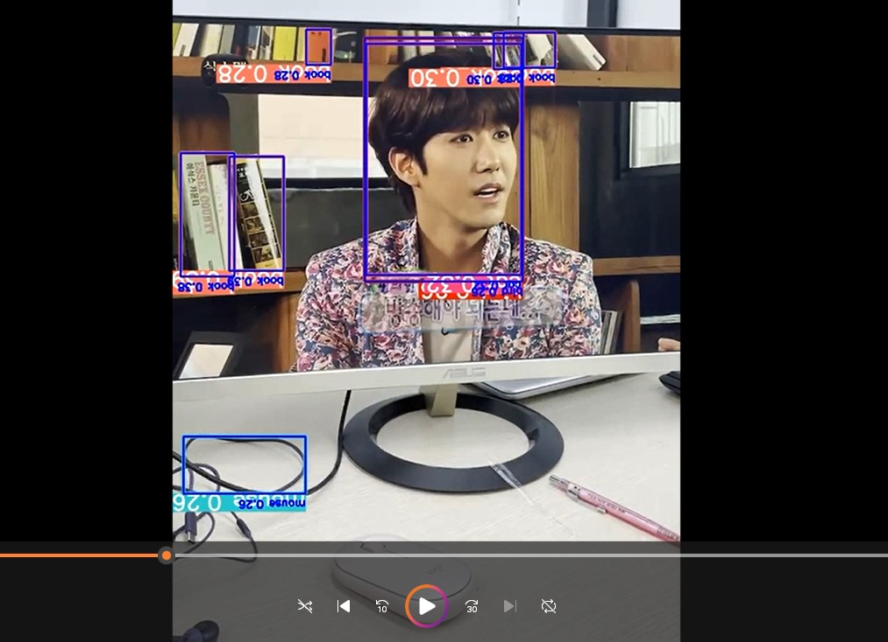

# Yolov5 object detection model deployment using flask
flask api/app을 통해 파이토치 허브에서 yolov5 개체 감지 모델

## Web app

이미지를 업도르하고 브라우저에서 모델의 추론 결과를 볼 수 있는 간단한 앱
실행시키는 방법:
```
`$ python webapp.py --port 5000`
```
then visit [http://localhost:5000/](http://localhost:5000/) in your browser:
## 메인화면 ,이미지와 비디오 객체탐지
<p align="center">

</p>
<p align="center">

</p>
<p align="center">

</p>
<p align="center">

</p>

## Rest API
Simple rest API exposing the model for consumption by another service. Run:

모델추론 결과 반환:

```
[{'class': 0,
  'confidence': 0.8197850585,
  'name': 'person',
  'xmax': 1159.1403808594,
  'xmin': 750.912902832,
  'ymax': 711.2583007812,
  'ymin': 44.0350036621},
 {'class': 0,
  'confidence': 0.5667674541,
  'name': 'person',
  'xmax': 1065.5523681641,
  'xmin': 116.0448303223,
  'ymax': 713.8904418945,
  'ymin': 198.4603881836},
 {'class': 27,
  'confidence': 0.5661227107,
  'name': 'tie',
  'xmax': 516.7975463867,
  'xmin': 416.6880187988,
  'ymax': 717.0524902344,
  'ymin': 429.2020568848}]
```

## 실행방법
로컬환경 실행

* `(venv) $ pip install -r requirements.txt`
* `(venv) $ python restapi.py --port 5000`

## Docker

```
# Build
docker build -t yolov5-flask .
# Run
docker run -p 5000:5000 yolov5-flask:latest
```

## reference
- https://github.com/ultralytics/yolov5
- https://github.com/jzhang533/yolov5-flask (this repo was forked from here)
- https://github.com/avinassh/pytorch-flask-api-heroku
